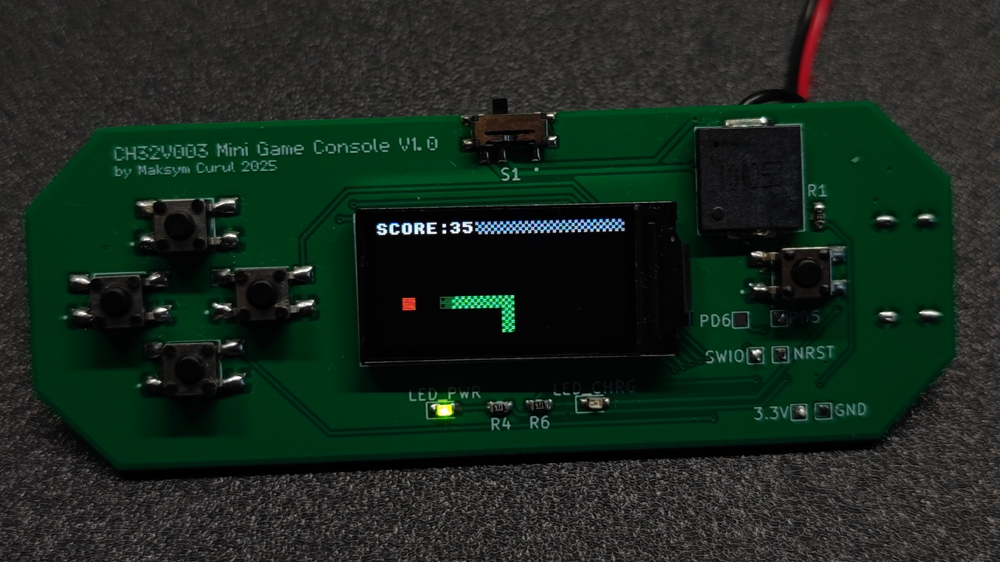
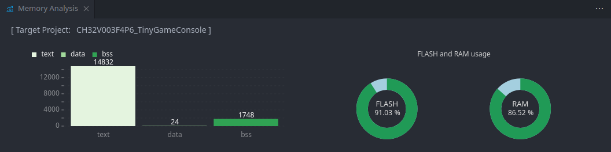
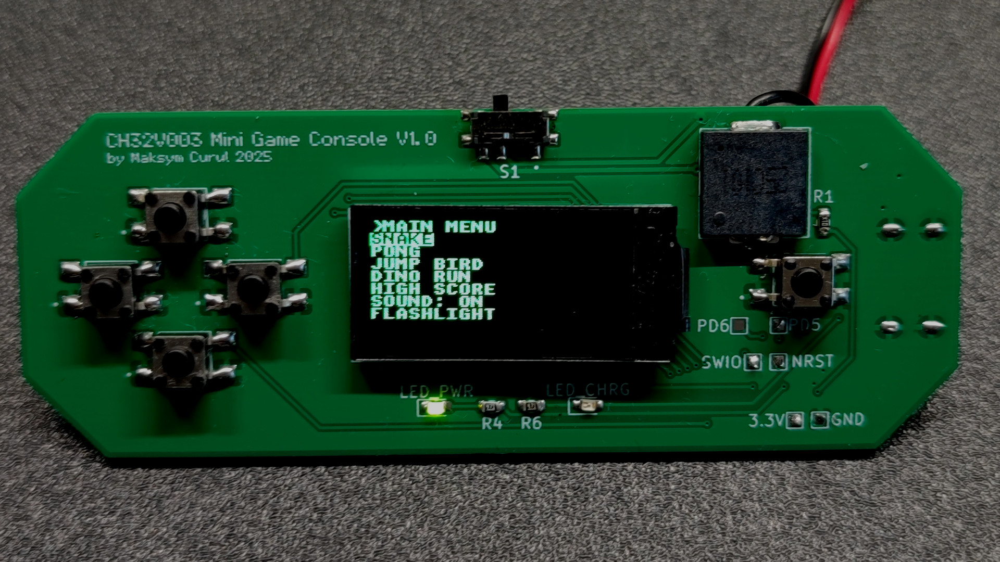
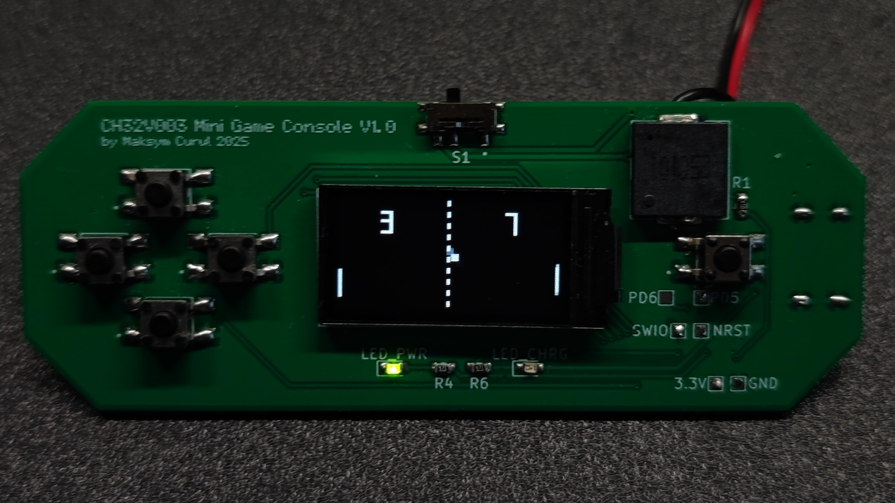
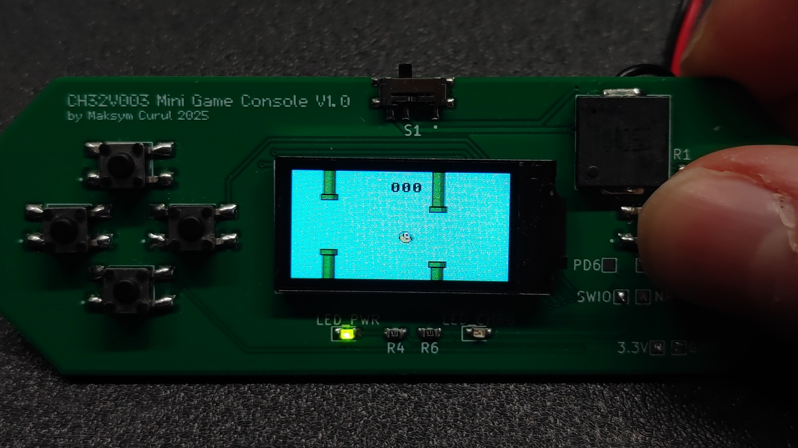
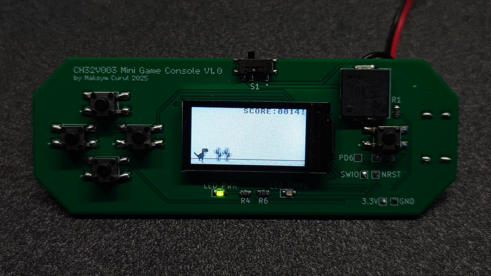
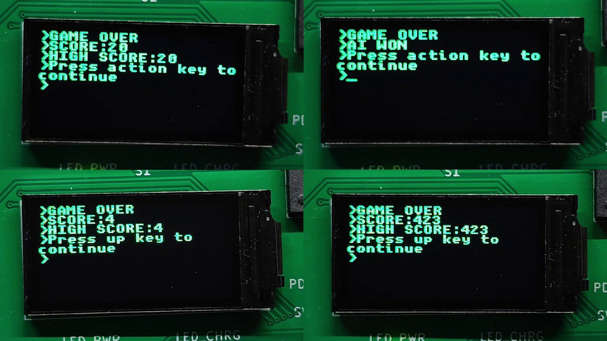
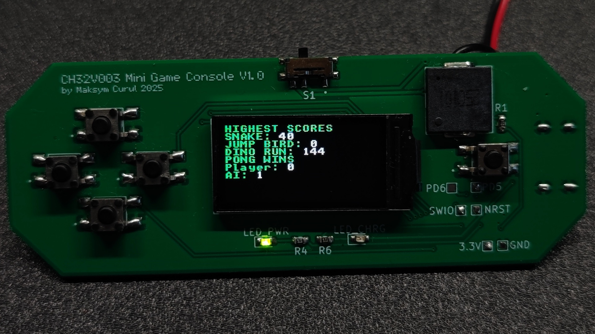

# CH32V003 Mini Game Console

## Introduction
Hi! I present to you a little project I have been working on... honestly, for a few years (on and off). But it's finally finished! This Mini Game Console uses one of the cheapest MCUs available, the CH32V003 (chosen when the project began in mid-2023), paired with also one of the cheapest color LCD display featuring a mind-blowing 80x160 resolution.

Despite memory limitations, it runs games with full 16-bit color\* graphics at 30 FPS (It can technically hit 60 FPS in all example games, but I designed them for 30, so I locked it there.) It supports either terminal grid and sprite graphics, has simple sound system and even option to save high score data.

It has simple "*game engine*" and each game can be kind of treated as independent program. There is API for buttons, sound and graphics, but it's all low-level anyways, so making games still require some knowledge how it all works overall.

Advanced game like Dino Run takes about ~2 kB in code alone. But for simple one like snake it's around 0.5 kB. With the example games and lto enabled there is about 1 kB of FLASH memory left, as well there are two free GPIOs. I didn't have idea what else to add despite e.g. flashlight functionality, but the project still can be expanded.

\**Single sprite can have 3 colors + transparency, but every sprite can use different palette.*

## Specifications
- **MCU:** CH32V003F4P6 (16 kB FLASH, 2 kB RAM, 48 MHz RISC-V)
- **Display:** ST7735 80x160 IPS LCD (SPI)
- **Audio:** PWM Buzzer
- **Input:** 5 Buttons
- **Current Games:**
    * Snake
    * Pong
    * Jump Bird
    * Dino Run
- **Other Features:**
    * High Score Saving
    * Flashlight Mode
    * Low Battery Detection

## Showcase Video

---

## Detailed Overview
Below I described the most important functionalities in more detail.

### Graphics System (`termGFX`)
Obviously, there is no way to fit a full frame buffer for this LCD into the MCU's available RAM. To solve this, graphics rendering is based on 8x8 blocks, and the main mode of operation is simple terminal-like graphics.

#### Terminal Graphics
Instead of storing whole picture in the memory, MCU uses map of chars and their color on the grid. Each block contains 2 bytes of information: character, 4-bit background color, 4-bit foreground color. On 80x160 display there are 200 blocks, so whole "frame buffer" for terminal uses 400 bytes of memory.

However, the buffer cannot be send to the LCD in format like that. That's why next step is rendering each block into little 8x8 frame buffer and drawing it on the screen in the right position. Rendering function checks which character to draw and in which colors, then renders the bitmap in the output buffer. Next the buffer is send to the LCD. 

That's the simple version. To achieve the higher frame rate there are further optimizations.

First, there is a map of 'dirty' blocks. An array of variables that act as bit fields, where '1' means change and '0' means lack of changes. All the exposed drawing functions write into that map. When the `tGFX_Update` is called to send the frame to LCD, the rendering function reads the map and skip all the blocks that didn't change. It also resets state of all the drawed blocks to '0'.

Second, the DMA of MCU is utilized to send data to LCD. And when data is being send to the LCD over SPI, the CPU switches output buffer and begin to render the next block. So we trade x2 RAM usage for almost x2 throughput increase.

Overall the terminal graphics in used configuration uses ~700 bytes of RAM. The usage can be further decreased by e.g. using only B/W colors. It can be also increased if we want more colors of text. But in this project I decided on compromise of 4-bit foreground/background colors of text.

This mode can be already used to make simple games. The Snake game implementation uses only this grid terminal graphics and custom characters. But for other games the 'free' graphics is needed, something that doesn't need to be aligned with the grid.

#### Sprite Graphics
Sprite system is based on map similar to the map of blocks to update. This time however, the '1' means block containing sprite. That's the simple part. From there it gets a bit complicated (at least in code), but the overall idea is pretty straightforward.

First step, or more like, step zero: sprites allocation. The code requires to know how many sprites are used, as well as information about them: position, size and color palette. Because when step one occurs and the block with sprite is processed, first thing that code does is iterating through all the allocated sprites and checking which one, and which part of it is on the current block.

When it finds out everything, the next step is rendering the sprite. To save memory, the sprites are encoded using 2-bit colors, so there is a bit of bit shuffling to decode them. The real colors are taken from palette attached to the sprite descriptor. Because color 0 is transparency, there are only 3 colors per sprite. But because of transparency, many sprites can be stacked on each other to achieve more colors.

And that's it. The efficiency of this solution heavily depends on what sprites and how many of them are used. If sprites are very large, probably stacking three or four on each other would make it... Well, maybe not so much lagging as just weird to look at, because of the block based rendering. With very small sprites, we can use a lot more, but sooner or later the boundary checking loop with o(n) complexity would become a problem.

There is probably a way to make it better, but it works fine for the games I wanted to make.

### The "*game engine*"
Calling this a 'game engine' might be a bit of an exaggeration. In reality, `engine.c` is primarily a system that manages function callbacks via a timer. It allows the current running 'program' (game) to be switched by simply changing the callback.

The current running 'program' is changed by changing the callback.

It also contains the common 512 bytes of memory that all the games share. A simple array that allows for simple dynamic allocation. The whole system is minimal, basically game can only allocate bytes, check how much memory is left, and clear it all.

### Menu

The main menu simply changes the engine callback to the entry point of selected game/utility. Besides displaying the list of games, it also displays a low-battery warning in the footer. It can also toggle sound generation.

Going back to the main menu is a matter of changing the callback back to main menu main function. And that entirely depends on whichever 'program' is being executed right now.

### Games
Each game act as indepent program with its own setup function and loop function. Every game has also struct `gs` (game state) that holds all the variables. The struct is actually a pointer mapped on the common memory pool. So, each game uses only 4 bytes of statick RAM for this pointer.

When I'm looking at this system now, it could be done better. Everything could just happen on stack. But it works, and I wanted to finally call this project  finished, so I left it like that.

I made four example games listed below:

#### Snake

#### Pong

#### Jump Bird (Flappy Bird clone)

#### Dino Run ("No Internet" Chrome game)

For gamplay watch the video (1:12): https://youtu.be/mhWHda4XlT0?si=jpvWHffCmz2jvb9t&t=72

### Game Over Screen

To save memory, the game over screen is also a 'game' that gets turn on when the game is over. The game that was running can set which button brings back main menu, what score to display etc.

### High Scores System

The console has a presistant memory to save high scores in games. It utalizes last page of CH32V003 flash. The pages of memory are 64 bytes in size, so we don't have to sacrafice lot of internal storage for that functionality.

The memory can be wiped by user. The scores are obviously saved only if current score is higher than previous one in memory.

### Other
#### Sound
Sound is generated using PWM and buzzer. Game can either play single tone for specific amount of time, or use a buffer of frequency and time values that will play in sequence automatically.

#### Input
Buttons are debounced and reading of their state is based on pooling. Games can also read raw state of the GPIO inputs and don't wait for debaunced input.

#### Battery Level Reading
Battery level is measured using PVD periphearl, not ADC. So, console can only tell if voltage is low or not.

### Hardware
> [!CAUTION]
> I designed example PCB that you can see on all the pictures. I share it, however, some resistors values depend on parts that you would use (LEDs, charging current). Also I modified the PCB and schematic indempedly while working on the project, so some fixes might be required. **If you intend to build one please double check it!** 
> I designed it assuming Li-Po cell with build in protection. **DO NOT USE UNPROTECTED CELLS!**
> There is a minor symmetry issue in the design: the power switch is centered relative to the LCD's active area, not the PCB itself

### Code Compilation
> [!TIP]
> To build the MounRiver Studio project with the lto (Link Time Optmalization) enabled, you must use GCC 12. The GCC 8 selected by default is bugged (at least from my experience): it cuts out all interrupt functions and volatile variables. 
